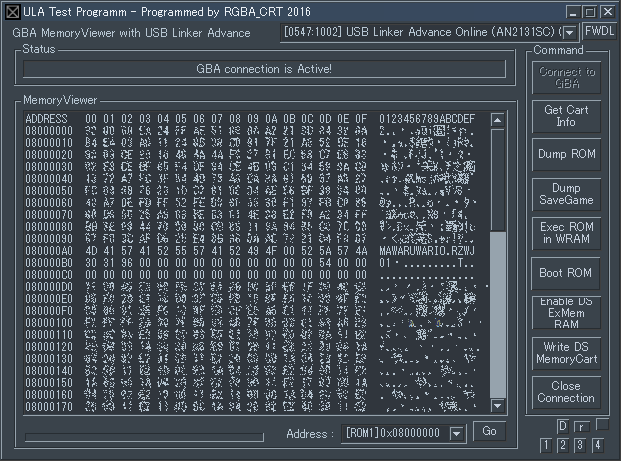

# GBA-Memviewer-ULA
ULA(USB Linker Advance) test program

see: [ula_driver_libusb](https://github.com/RGBA-CRT/ula_driver_libusb)

## About
+ ULAのテストプログラムです。
+ GBAのROM吸出しのサポートのみであとはほとんど未実装です。
+ [ula_driver_libusb](https://github.com/RGBA-CRT/ula_driver_libusb)のサンプルとしておいておきます。
+ プログラムは[ULA-HostV2(build 20030731)](http://www2.teamknox.com/teamknox_old/ula/ula.html)を参考にActiveBasicで書き直されています。

## Licence
全体的にCC0です。
[libusb](https://github.com/libusb/libusb)部分はLGPLが適用されます。